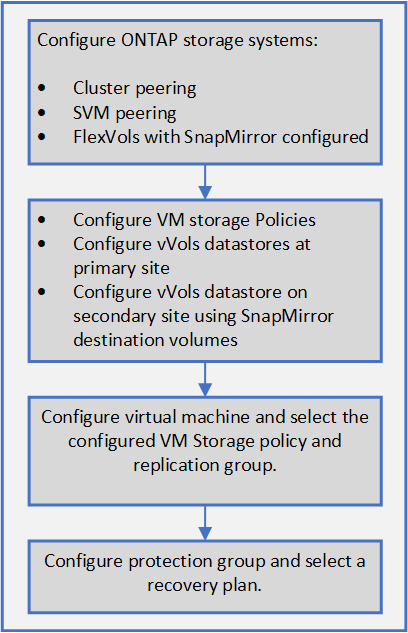

= Configurez la réplication pour les datastores vvols
:allow-uri-read: 
:icons: font
:imagesdir: ../media/

[role="lead"]
Vous pouvez configurer la réplication de votre datastore vvols à l'aide de l'appliance virtuelle pour VSC, VASA Provider et SRA. L'objectif principal de la réplication de vvols est de protéger les ordinateurs virtuels stratégiques lors d'une reprise après incident à l'aide de VMware site Recovery Manager (SRM).

Cependant, pour configurer la réplication de vvols pour votre appliance virtuelle pour VSC, VASA Provider et SRA, il est nécessaire d'activer les fonctionnalités de VASA Provider et la réplication vvols. Vasa Provider est activé par défaut dans l'appliance virtuelle pour VSC, VASA Provider et SRA. La réplication basée sur les baies est effectuée au niveau FlexVol. Chaque datastore vvols est mappé à un conteneur de stockage composé d'un ou plusieurs volumes FlexVol. Les volumes FlexVol doivent être préconfigurés avec SnapMirror à partir de ONTAP.

[NOTE]
====
Vous ne devez pas configurer un mélange de machines virtuelles protégées et non protégées dans un seul datastore vvols. Une opération de reprotection après le basculement entraîne la suppression des machines virtuelles non protégées. Assurez-vous que tous les ordinateurs virtuels d'un datastore vVols sont protégés lors de l'utilisation de la réplication.

====
Des groupes de réplication sont créés lors de la création du workflow de data store vVvols pour chaque volume FlexVol. Pour utiliser la réplication vvols, vous devrez créer des stratégies de stockage de machines virtuelles incluant l'état et la planification de la réplication avec le profil de capacité de stockage. Un groupe de réplication comprend des machines virtuelles répliquées dans le cadre de la reprise sur incident vers le site cible. Vous pouvez configurer des groupes de réplication avec des groupes de protection et des plans de restauration à l'aide de la console SRM, pour les flux de travail de reprise après incident.

[NOTE]
====
Si vous utilisez une reprise après incident pour le datastore vvols, il n'est pas nécessaire de configurer Storage Replication adapter (SRA) séparément puisque la fonctionnalité VASA Provider est améliorée pour disposer d'une réplication vvols.

====

